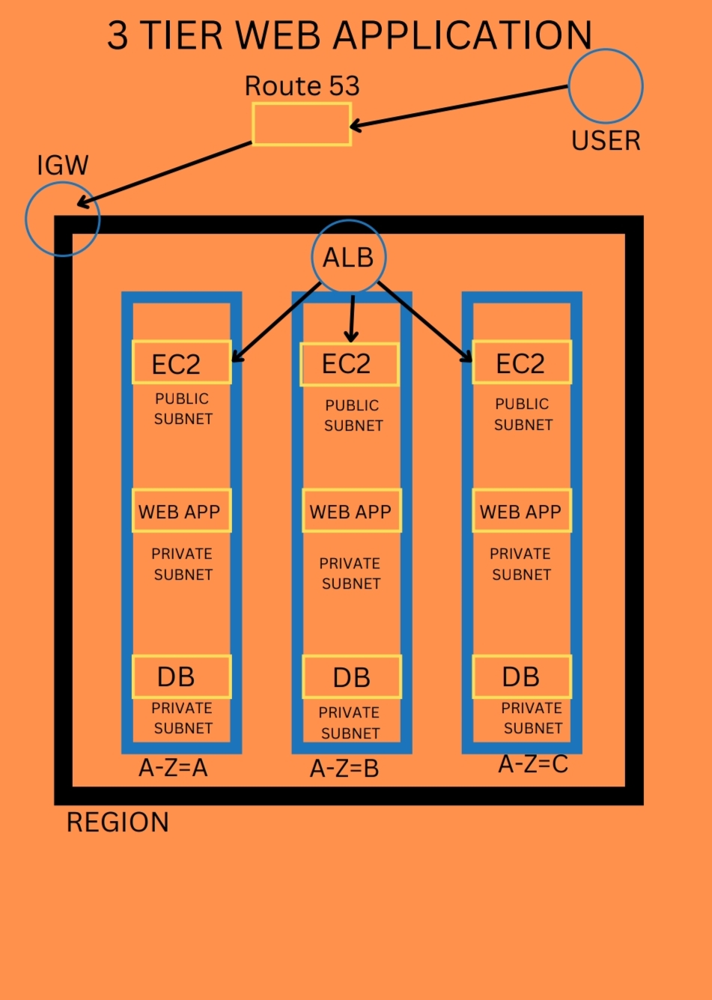

# AWS 3-Tier Architecture Deployment 🚀

# aws-3-tier-architecture
Deployed a scalable AWS 3-tier architecture using EC2, ALB, Auto Scaling, RDS, and CloudFront

# AWS 3-Tier Architecture Deployment 🚀

## 📌 Overview
This project demonstrates the deployment of a scalable and secure 3-tier web architecture on AWS Free Tier. It includes a presentation layer, application layer, and database layer designed for high availability and performance.

---

## 🧩 Architecture
- Presentation Layer: CloudFront + Route 53
- Application Layer: EC2 with Auto Scaling and Application Load Balancer
- Database Layer: Amazon RDS (MySQL)

---

## ⚙️ Services Used
- Amazon EC2
- Application Load Balancer (ALB)
- Auto Scaling Group
- Amazon RDS (MySQL)
- Amazon CloudFront
- Amazon Route 53
- Amazon CloudWatch
- SNS (Simple Notification Service)
- VPC (Public & Private Subnets)

---

## 🚀 Implementation Steps

1. Created a Launch Template for EC2 instances  
2. Configured Auto Scaling Group for scalability  
3. Set up Application Load Balancer for traffic distribution  
4. Deployed EC2 instances in private subnet  
5. Configured RDS database in private subnet  
6. Connected EC2 with RDS securely  
7. Created snapshots for backup  
8. Configured CloudFront for content delivery  
9. Set up CloudWatch alarms and dashboard  
10. Configured SNS notifications  
11. Created billing alarm for cost monitoring  

---

## 🔐 Security
- Used custom VPC with public and private subnets  
- Applied security groups to control traffic  
- Database isolated in private subnet  

---

## 🧩 Architecture Diagram

---

## 📸 Screenshots
### Application Load Balancer

Configured ALB to distribute incoming traffic across EC2 instances.

---

### EC2 Instances

Deployed EC2 instances in private subnet for application layer.

---

### RDS Database

Configured MySQL RDS instance for database layer.

---

### EC2 to RDS Connection

Established secure connection between EC2 and RDS.

---

### CloudWatch Monitoring

Created alarms for CPU utilization and monitoring.

---

### CloudFront CDN

Configured CloudFront for faster content delivery.

---

## 📄 Documentation
[View Full Project Documentation](aws-3-tier-project.pdf)
